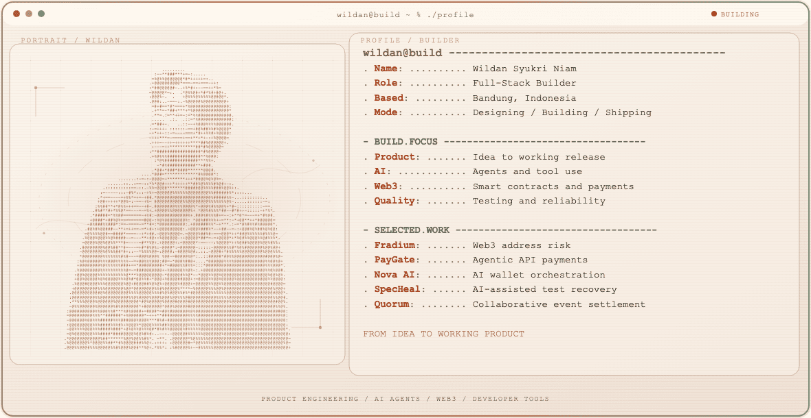

  <picture>
    <source media="(max-width: 760px) and (prefers-color-scheme: dark)" srcset="./assets/hero/builder-profile-v1-mobile-dark.svg">
    <source media="(max-width: 760px)" srcset="./assets/hero/builder-profile-v1-mobile-light.svg">
    <source media="(prefers-color-scheme: dark)" srcset="./assets/hero/builder-profile-v1-dark.svg">
    <source media="(prefers-color-scheme: light)" srcset="./assets/hero/builder-profile-v1-light.svg">
    
  </picture>

## Hey, I'm Wildan

I'm a **full-stack builder** based in Bandung, Indonesia. I work across **AI agents, Web3, and developer tools**—shaping products, leading teams, and building the software behind them.

I enjoy taking projects from an early idea to a working release: defining the product, building the core system, testing the final flow, and often coordinating the team along the way.

## What I Build

- **Product & full-stack engineering** — from product direction and interface design to backend systems, integrations, deployment, and QA.
- **AI products** — tool-using agents, purpose-built interfaces, and workflows that keep people in control.
- **Web3 applications** — wallet intelligence, API payments, smart contracts, and on-chain product flows.
- **Developer tools** — testing, reliability, and AI-assisted engineering workflows.

## Selected Work

| Project | What I built | My role · Current state |
| --- | --- | --- |
| [**Fradium**](https://github.com/fradiumofficial/fradium) · [Live beta](https://fradium.io) | Surfaces address risk before a user sends funds by combining AI output with community signals. | Team Lead · Full-Stack Developer Public Beta |
| [**PayGate**](https://github.com/wildanniam/paygate-stellar) · [Testnet beta](https://trypaygate.com) | Lets machine clients pay for individual API requests through HTTP 402 and Stellar testnet. | Founder · Builder Stellar Testnet Beta |
| [**Nova AI Wallet**](https://github.com/OfficialNovaAI/nova-wallet) · [Public prototype](https://nova-wallet-puce.vercel.app) | Turns wallet intent into clear actions while the connected wallet keeps final signing. | Team Lead · AI Engineer Public Prototype · Degraded |
| [**SpecHeal**](https://github.com/antech2-async/SpecHeal) | Helps teams distinguish safe selector recovery from real product bugs before applying a controlled repair. | Team Lead · Full-Stack & Product Developer Hackathon Prototype · Offline |
| [**Quorum**](https://github.com/wildanniam/Quorum) · [Testnet build](https://quorum-sandy-eight.vercel.app) | Connects event checkout, collaborator splits, wallet-bound passes, gated resources, and withdrawals. | Team Lead · Full-Stack & Smart Contract Engineer Active Stellar Testnet Build |

## Selected Highlights

- **Fradium team** — winner of the [WCHL 2025 Global Finale Fully On-Chain Track](https://bse.telkomuniversity.ac.id/tim-fradium-berhasil-meraih-global-finale-winner-fully-on-chain-track-pada-world-computer-hacker-league-2025/).
- **PayGate** — awarded a [$5,000 Stellar Community Fund Instaward](https://x.com/Indo_Stellar/status/2075550378553421994).
- **Nova AI team** — 1st notable mention and 1st Social Media Challenge winner at the [SEA Lisk Builder Challenge 3](https://bse.telkomuniversity.ac.id/prestasi-tim-nova-ai-di-south-east-asia-lisk-builder-challenge-3/).
- **SpecHeal team** — [2nd place at Refactory Hackathon 2026](https://portofolio-wildan-zeta.vercel.app/).

## What I'm Exploring

I'm interested in AI agents that can work with real tools, software, and financial systems—not only generate text.

Research helps me understand the deeper questions. Building prototypes and products is how I test those ideas in practice.

## Tools I Use

`TypeScript` · `Next.js` · `React` · `Node.js` · `Python` · `Rust` · `Motoko` · `PostgreSQL` · `Playwright` · `Stellar` · `Internet Computer`

<strong>Recent public activity</strong>

 

<!-- AUTO:ACTIVITY:START -->
- Jul 16, 2026: pushed 1 commit to [wildanniam/web-portfolio](https://github.com/wildanniam/web-portfolio).
- Jul 16, 2026: opened pull request [#8](https://github.com/wildanniam/web-portfolio/pull/8) in [wildanniam/web-portfolio](https://github.com/wildanniam/web-portfolio).
- Jul 16, 2026: created a branch in [wildanniam/web-portfolio](https://github.com/wildanniam/web-portfolio).
- Jul 16, 2026: opened issue [#7](https://github.com/wildanniam/web-portfolio/issues/7) in [wildanniam/web-portfolio](https://github.com/wildanniam/web-portfolio).
- Jul 16, 2026: opened pull request [#6](https://github.com/wildanniam/web-portfolio/pull/6) in [wildanniam/web-portfolio](https://github.com/wildanniam/web-portfolio).
- Jul 16, 2026: opened issue [#5](https://github.com/wildanniam/web-portfolio/issues/5) in [wildanniam/web-portfolio](https://github.com/wildanniam/web-portfolio).
<!-- AUTO:ACTIVITY:END -->

---

  Building useful products around AI, Web3, and developer tools.

